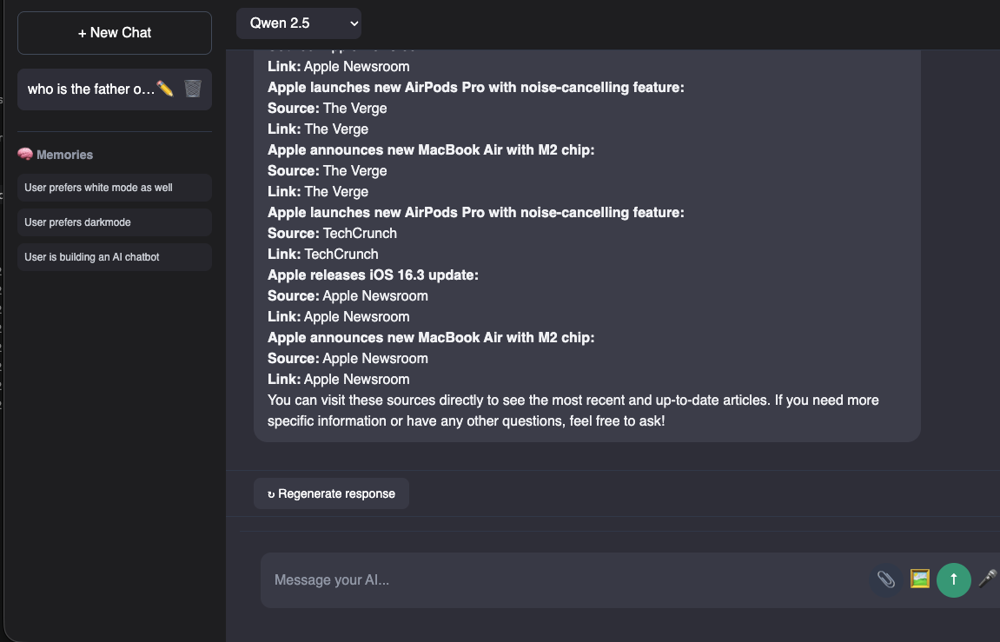
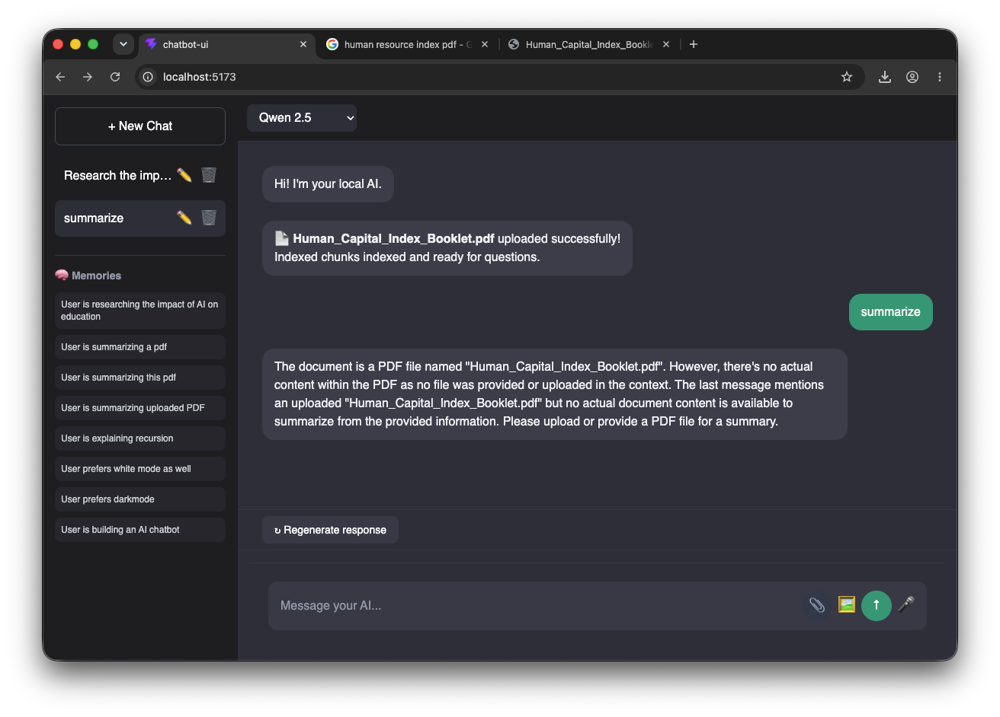
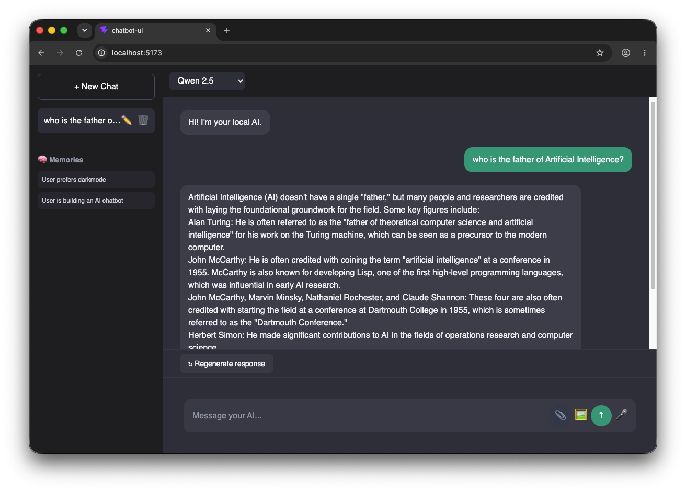

# 🤖 AI Chatbot V2.2 — Autonomous Multimodal AI Agent

A full-stack **ChatGPT-style AI assistant** built with **React, FastAPI, Ollama, ChromaDB, SQLite, and LLaVA**.

V2.2 introduces an **Autonomous Tool Router** and **Deep Research Agent** that intelligently chooses between Memory, PDF RAG, Web Search, Vision, and Research without relying on hard-coded keywords.

---

# ✨ Features

* 🧭 Autonomous AI Tool Router
* 🔬 Deep Research Agent (multi-search + AI report)
* 🧠 Long-term Memory
* 📄 PDF RAG (Retrieval-Augmented Generation)
* 🌐 Live Web Search
* 🔗 Clickable Source Citations
* 🖼️ Image Understanding (LLaVA)
* 🎤 Voice Input (Speech-to-Text)
* 🔊 AI Voice Responses (Text-to-Speech)
* 🤖 Multi-model Support
* 💾 Persistent Chat History
* ✏️ Rename & Delete Conversations
* 🌙 Modern ChatGPT-inspired UI

---

# 📸 Screenshots

## 💬 Chat Interface


---

## 🧠 Long-Term Memory

The assistant remembers user preferences and ongoing projects across conversations.


---

## 🌐 Web Search with Citations

Ask about current events and receive live answers with clickable sources.



---

## 📄 PDF RAG

Upload any PDF and ask questions about its contents.



---

## 🖼️ Vision (LLaVA)

Upload an image and let the AI describe and analyze it.



---

## 🔬 Deep Research Agent

Generate structured research reports powered by multiple web searches and AI analysis.


---

# 🚀 What's New in V2.2?

### 🧭 Autonomous Tool Router

The AI automatically decides which tool to use.

| User Request                 | Tool Selected |
| ---------------------------- | ------------- |
| What's my favorite language? | 🧠 Memory     |
| Summarize my uploaded PDF    | 📄 PDF        |
| Latest Apple news            | 🌐 Web        |
| Research AI in education     | 🔬 Research   |
| Explain recursion            | 🤖 General    |

---

### 🔬 Deep Research

The Research Agent performs:

1. Multiple web searches
2. Source aggregation
3. AI analysis
4. Structured report generation
5. Clickable citations

Example prompt:

> Research the impact of AI on education

---

# 🏗️ Tech Stack

| Layer           | Technology                  |
| --------------- | --------------------------- |
| Frontend        | React + Vite + Tailwind CSS |
| Backend         | FastAPI                     |
| Database        | SQLite                      |
| Vector Database | ChromaDB                    |
| AI Runtime      | Ollama                      |
| Vision          | LLaVA 7B                    |
| Embeddings      | Nomic Embed Text            |
| Research        | DuckDuckGo + Qwen           |

---

# 🤖 Supported Models

* Qwen 2.5 (Default)
* Llama 3.2
* Mistral 7B
* DeepSeek R1
* LLaVA 7B (Vision)

---

# 📂 Project Structure

```text
AI-Chatbot/
│
├── chatbot-api/
│   ├── main.py
│   ├── router.py
│   ├── research.py
│   ├── memory.py
│   ├── database.py
│   ├── models.py
│   ├── rag/
│   └── tools/
│
├── chatbot-ui/
│   ├── src/
│   ├── components/
│   └── App.jsx
│
├── screenshots/
│   ├── chat.png
│   ├── memory.png
│   ├── web-search.png
│   ├── pdf.png
│   ├── vision.png
│   └── research.png
│
└── README.md
```

---

# ⚡ Installation

## Backend

```bash
cd chatbot-api

python3 -m venv .venv
source .venv/bin/activate

pip install -r requirements.txt

uvicorn main:app --reload
```

Runs on:

```text
http://127.0.0.1:8000
```

## Frontend

```bash
cd chatbot-ui

npm install
npm run dev
```

Runs on:

```text
http://localhost:5173
```

---

# 🧠 Version History

| Version  | Features                   |
| -------- | -------------------------- |
| V1.1     | Local AI Chatbot           |
| V1.2     | Multi-model + Regenerate   |
| V1.3     | PDF RAG + Vision           |
| V1.4     | Voice Assistant            |
| V1.5     | Web Search Agent           |
| V1.6     | Clickable Source Citations |
| V2.0     | Long-term Memory Agent     |
| V2.1     | Autonomous Tool Router     |
| **V2.2** | Deep Research Agent        |

---

# 🎯 Highlights

* Autonomous AI Tool Routing
* Multi-source Deep Research
* Long-term Memory
* PDF Question Answering
* Vision with LLaVA
* Live Web Search
* Voice Conversations
* Streaming Responses
* Fully Local AI using Ollama

---

# 📄 License

MIT License

---

# 👨‍💻 Author

**Basu**

Built with ❤️ using React, FastAPI & Ollama.
