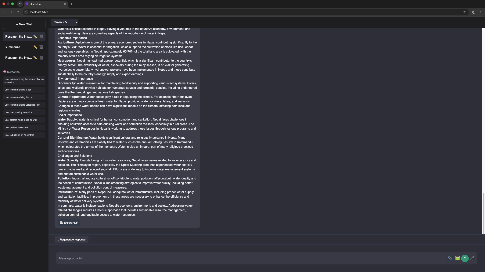

# 🤖 AI Workspace V3.3 — Autonomous Multi-Agent AI Assistant

A full-stack **multi-agent AI workspace** built with **React, FastAPI, Ollama, Qwen, LLaVA, ChromaDB, and RAG**. It supports long-term memory, PDF retrieval, deep research, vision, voice input, and collaborative AI agents with a live execution timeline.

---

## ✨ V3.3 Features

* 🧠 Autonomous Multi-Agent Orchestrator
* 📊 Live Agent Timeline UI
* 📄 PDF RAG with ChromaDB
* 🌐 Deep Research with Web Search & Citations
* 💾 Long-Term Memory
* 🖼️ Vision AI (LLaVA)
* 🎙️ Voice-to-Text Input
* 📑 Export AI Responses as PDF
* 📎 Drag & Drop PDF Upload
* 📜 Auto-Scrolling Chat Experience
* 📋 Copy Code Blocks
* 💬 Chat History (Rename & Delete)

---

## 📸 Screenshots

> Place these images in **`chatbot-ui/public/screenshots/`**

### Memory Timeline


### Multi-Agent Timeline


### PDF Upload & RAG



### Vision AI


### Deep Research


---

## 🏗️ Architecture

```text
React UI
    │
    ▼
 FastAPI Backend
    │
    ▼
 Multi-Agent Orchestrator
 ├── Memory Agent
 ├── PDF Agent
 ├── Research Agent
 └── Vision Agent
    │
    ▼
 Ollama (Qwen / LLaVA)
    │
    ▼
 ChromaDB + SQLite
```

---

## 🧠 Multi-Agent Workflow

```text
User Prompt
     │
     ▼
Orchestrator
     │
 ┌───┼───────────────┐
 │   │               │
 ▼   ▼               ▼
Memory PDF        Research
 │    │              │
 └────┴──────┬───────┘
             ▼
      Merged Context
             ▼
      Qwen Generates Answer
             ▼
   Agent Timeline + Sources
```

---

## 🛠 Tech Stack

| Layer           | Technology                  |
| --------------- | --------------------------- |
| Frontend        | React + Vite + Tailwind CSS |
| Backend         | FastAPI                     |
| Local LLM       | Ollama                      |
| Chat Model      | Qwen 2.5                    |
| Vision Model    | LLaVA 7B                    |
| Vector Database | ChromaDB                    |
| Embeddings      | all-MiniLM-L6-v2            |
| Memory          | SQLite                      |
| PDF             | LangChain + PyPDF           |
| Research        | DuckDuckGo Search           |

---

## 📂 Project Structure

```text
AI-Chatbot/
│
├── chatbot-api/
│   ├── agents/
│   ├── rag/
│   ├── memory.py
│   ├── pdf_export.py
│   ├── database.py
│   └── main.py
│
└── chatbot-ui/
    ├── src/
    │   ├── components/
    │   └── App.jsx
    └── public/
        └── screenshots/
            ├── home.png
            ├── agent-timeline.png
            ├── pdf-upload.png
            ├── vision-ai.png
            └── research.png
```

---

## 🚀 Installation

### 1. Clone the repository

```bash
git clone https://github.com/yourusername/AI-Chatbot.git
cd AI-Chatbot
```

### 2. Backend

```bash
cd chatbot-api

python -m venv .venv
source .venv/bin/activate

pip install -r requirements.txt

uvicorn main:app --reload
```

Backend runs on:

```text
http://127.0.0.1:8000
```

### 3. Frontend

```bash
cd chatbot-ui

npm install
npm run dev
```

Frontend runs on:

```text
http://localhost:5173
```

---

## 💡 Example Prompts

### PDF RAG

> Summarize the uploaded PDF

### Deep Research

> Research the impact of AI on education

### Vision

> Describe this image

### Multi-Agent

> Compare my uploaded PDF with today's AI news

### Memory

> What's my favorite programming language?

---

## 📈 Version History

| Version  | Features                                                         |
| -------- | ---------------------------------------------------------------- |
| V1.0     | React + FastAPI Chat                                             |
| V2.0     | Chat History + Memory                                            |
| V2.1     | PDF RAG + ChromaDB                                               |
| V2.2     | Deep Research                                                    |
| V2.3     | Vision + Voice + PDF Export                                      |
| V3.1     | Multi-Agent Orchestrator                                         |
| V3.2     | Agent Timeline UI                                                |
| **V3.3** | Live Agent Execution, Drag & Drop Upload, Auto-Scroll, Copy Code |

---

## 🎯 Roadmap

* [x] Multi-Agent AI
* [x] Long-Term Memory
* [x] PDF RAG
* [x] Vision AI
* [x] Voice Input
* [x] Deep Research
* [x] PDF Export
* [x] Agent Timeline
* [ ] Project Workspace (V4.0)
* [ ] Shared Knowledge Base
* [ ] Collaborative Projects

---

## 👨‍💻 Author

**Bijesh Basu**

Built as a portfolio project demonstrating modern **Generative AI**, **RAG**, **Multi-Agent Systems**, and **Full-Stack AI Engineering** using React, FastAPI, Ollama, and ChromaDB.
