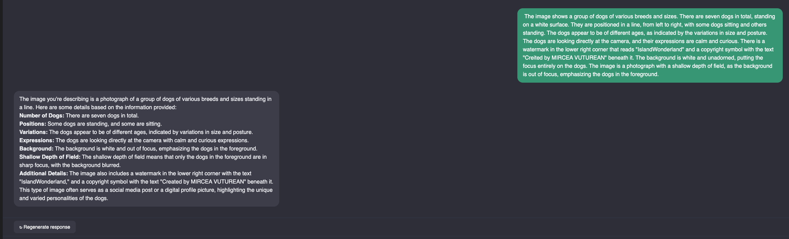
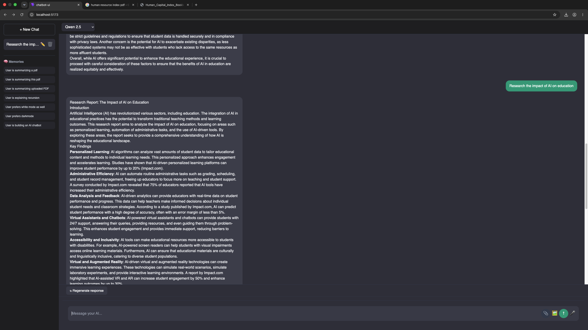
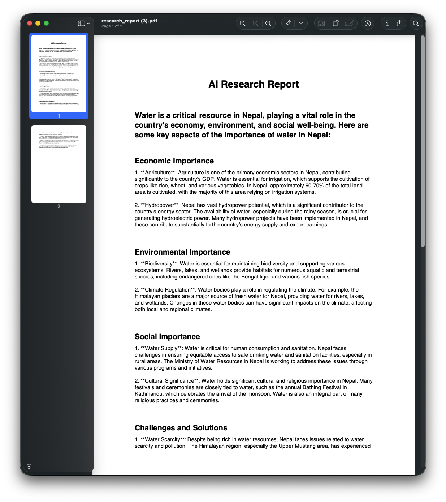

# 🤖 AI Chatbot V2.3 — Autonomous Multimodal AI Agent

A full-stack ChatGPT-style AI assistant built with **React, FastAPI, Ollama, ChromaDB, SQLite, and LLaVA**.

The project features autonomous tool routing, long-term memory, PDF RAG, deep research, voice interaction, image understanding, and AI-powered PDF report export.

---

## ✨ Features

### 🧠 AI Capabilities

* Autonomous Tool Router (Memory, PDF, Web, Research & General)
* Deep Research Agent with multi-source web search
* Long-Term Memory using SQLite
* PDF RAG (Retrieval-Augmented Generation)
* Live Web Search with citations
* Image Understanding with LLaVA
* Voice Input (Speech-to-Text)
* Voice Responses (Text-to-Speech)
* Multi-model support via Ollama

### 💻 Application Features

* Streaming AI responses
* Persistent chat history
* Rename & delete conversations
* Clickable source citations
* Export research reports as PDF
* Modern ChatGPT-inspired interface

---

## 🚀 What's New in V2.3?

### 🔬 Deep Research Agent

Generate structured research reports from multiple web searches.

Example prompt:

> Research the impact of AI on education

The agent automatically:

1. Searches multiple web sources
2. Aggregates information
3. Generates a structured report
4. Displays clickable citations
5. Exports the report as PDF

### 📄 PDF Export

Research reports can be downloaded as professionally formatted PDF documents with one click.

---

## 🧭 Autonomous Tool Router

The AI intelligently selects the correct tool based on user intent.

| User Request                 | Selected Tool    |
| ---------------------------- | ---------------- |
| What's my favorite language? | 🧠 Memory        |
| Summarize my uploaded PDF    | 📄 PDF RAG       |
| Latest Apple news            | 🌐 Web Search    |
| Research AI in education     | 🔬 Deep Research |
| Explain recursion            | 🤖 General AI    |

---

## 🏗️ Tech Stack

| Layer           | Technology                  |
| --------------- | --------------------------- |
| Frontend        | React + Vite + Tailwind CSS |
| Backend         | FastAPI                     |
| AI Runtime      | Ollama                      |
| LLM             | Qwen 2.5                    |
| Vision          | LLaVA 7B                    |
| Vector Database | ChromaDB                    |
| Database        | SQLite                      |
| Research        | DuckDuckGo Search           |
| PDF Export      | ReportLab                   |

---

## 📂 Project Structure

```text
AI-Chatbot/
│
├── chatbot-api/
│   ├── main.py
│   ├── router.py
│   ├── research.py
│   ├── pdf_export.py
│   ├── memory.py
│   ├── database.py
│   ├── rag/
│   └── tools/
│
├── chatbot-ui/
│   ├── src/
│   ├── components/
│   └── App.jsx
│
├── screenshots/
│   ├── chat.png
│   ├── memory.png
│   ├── web-search.png
│   ├── pdf.png
│   ├── vision.png
│   ├── research.png
│   └── research-export.png
│
└── README.md
```

---

## ⚡ Installation

### Backend

```bash
cd chatbot-api

python3 -m venv .venv
source .venv/bin/activate

pip install -r requirements.txt

uvicorn main:app --reload
```

Backend runs at:

```text
http://127.0.0.1:8000
```

### Frontend

```bash
cd chatbot-ui

npm install
npm run dev
```

Frontend runs at:

```text
http://localhost:5173
```

---

## 📸 Screenshots

Add your screenshots inside the `screenshots/` folder using these names:

* `chat.png`
* `memory.png`
* `web-search.png`
* `pdf.png`
* `vision.png`
* `research.png`
* `research-export.png`

Example:

```md





```

---

## 🧠 Version History

| Version  | Features               |
| -------- | ---------------------- |
| V1.0     | Local AI Chatbot       |
| V1.2     | Multi-model Support    |
| V1.3     | PDF RAG + Vision       |
| V1.4     | Voice Assistant        |
| V1.5     | Web Search Agent       |
| V1.6     | Clickable Citations    |
| V2.0     | Long-Term Memory       |
| V2.1     | Autonomous Tool Router |
| V2.2     | Deep Research Agent    |
| **V2.3** | Research PDF Export    |

---

## 🎯 Highlights

* Autonomous AI Tool Routing
* Deep Research with multiple sources
* Long-Term Memory
* PDF Question Answering (RAG)
* Vision AI with LLaVA
* Voice Conversations
* Streaming Responses
* PDF Report Export
* Fully Local AI using Ollama

---

## 📄 License

MIT License

---

## 👨‍💻 Author

**Basu**

Built with using React, FastAPI, Ollama & ChromaDB.
